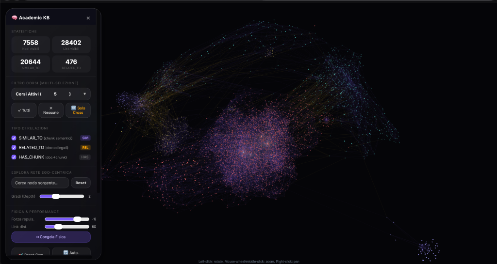
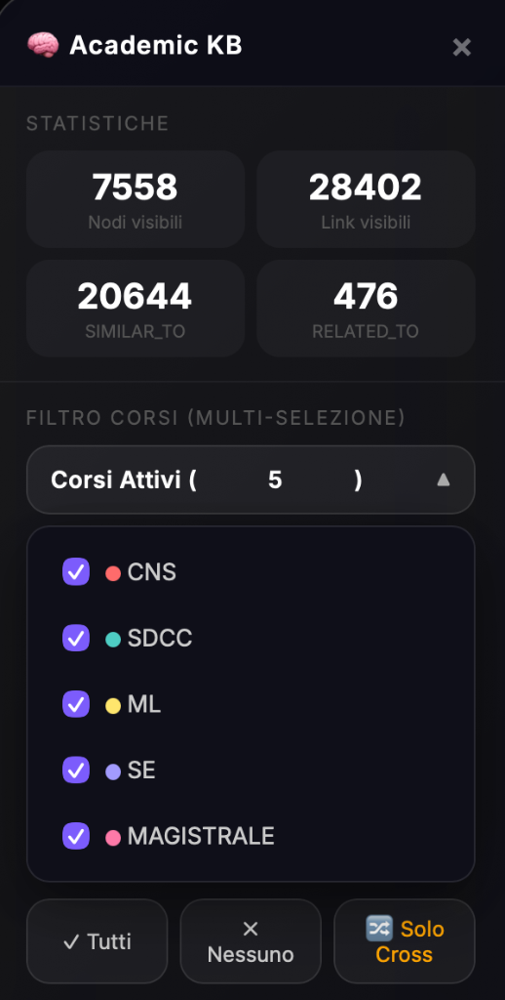
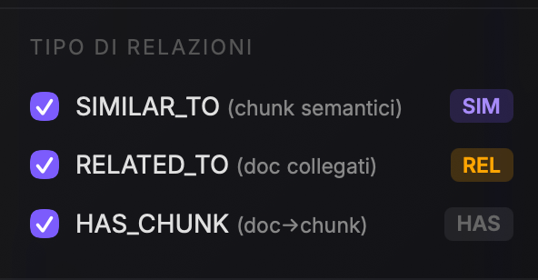
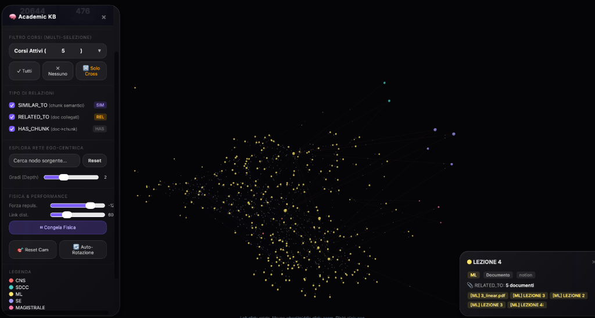
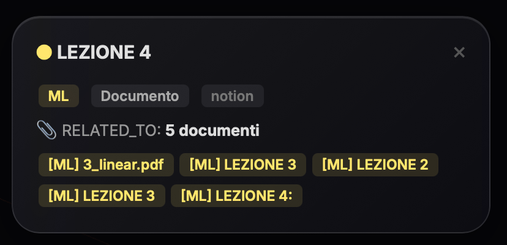

# 🧠 Academic KB — 3D Semantic Knowledge Graph & Retrieval System

An interactive 3D Knowledge Graph and multi-course RAG retrieval platform designed for Master's Degree academic courses (Machine Learning, Distributed Systems, Cybersecurity, Software Engineering, etc.). 

Academic KB unifies heterogeneous academic materials (Notion lecture notes, scientific PDFs, slide decks) into a unified semantic space using high-dimensional vector embeddings and a graph database (Neo4j), visualized in real-time with WebGL.

---

## 📸 Interfaccia Utente & Visualizzazione 3D

### 1. Panoramica del Grafo 3D (Constellation Overview)
L'interfaccia adotta un design **Apple Liquid Glass** con un HUD semitrasparente e non invasivo, visualizzando decine di migliaia di nodi e relazioni in un unico spazio 3D reattivo.

<p align="center">
  
</p>

- **HUD Statistiche in Tempo Reale**: monitora istantaneamente il numero di nodi visibili, link attivi e la distribuzione tra link semantici (`SIMILAR_TO`) e macro-relazioni tra documenti (`RELATED_TO`).
- **Flusso Dinamico di Particelle**: pacchetti luminosi viaggiano lungo gli archi per visualizzare lo scambio semantico e i ponti cross-disciplinari.

---

### 2. Filtro Corsi a Tendina & Isolamento "Solo Cross"
Per consentire l'esplorazione mirata, la barra laterale integra un menu a tendina multi-selezione in stile Apple con codifica colore per materia:

<p align="center">
  
</p>

* **Filtro Multiplo**: Attiva o disattiva istantaneamente materie specifiche (**CNS**, **SDCC**, **ML**, **SE**, **MAGISTRALE**) tramite checkbox personalizzate.
* **Comandi Rapidi**:
  * `✓ Tutti`: abilita tutti i corsi della costellazione.
  * `✗ Nessuno`: deseleziona tutto per partire da zero.
  * `🔀 Solo Cross`: isola unicamente i concetti e i documenti che creano collegamenti interdisciplinari tra corsi differenti (es. argomenti di Machine Learning applicati alla Cybersecurity).

---

### 3. Tipi di Relazioni & Ontologia Semantica
Il grafo modella tre livelli distinti di connessione, filtrabili dinamicamente tramite gli interruttori dedicati:

<p align="center">
  
</p>

| Relazione | Livello | Descrizione |
| :--- | :--- | :--- |
| **`SIMILAR_TO`** | *Chunk Semantici* | Connette coppie di frammenti di testo appartenenti a documenti diversi la cui *cosine similarity* supera la soglia (default `0.82`). Rappresenta concetti affini o condivisi tra le lezioni. |
| **`RELATED_TO`** | *Documenti Interi* | Relazione di sintesi ad alto livello tra interi documenti che condividono cluster significativi di chunk simili (minimo 3). |
| **`HAS_CHUNK`** | *Strutturale* | Lega gerarchicamente ciascun documento (file PDF o pagina Notion) ai rispettivi paragrafi/frammenti vettorializzati. |

---

### 4. Esplorazione, Focus & Scheda Dettaglio Documento
Cliccando su un qualsiasi nodo del grafo, la telecamera si focalizza sull'elemento e apre una scheda informativa dettagliata:

<p align="center">
  
</p>

<p align="center">
  
</p>

* **Metadati & Provenienza**: Identifica rapidamente il corso di appartenenza, la tipologia di nodo (Documento vs Chunk) e la sorgente d'origine (`notion` o file `pdf`).
* **Documenti Correlati Diretti**: Elenco cliccabile dei documenti collegati tramite `RELATED_TO`, permettendo una navigazione ipertestuale fluida attraverso le lezioni correlate.

---

### 5. Motore Cinematico & Esplorazione Dinamica
* **Esplorazione Rete Ego-Centrica**: digitando il titolo di un nodo o concetto, si avvia un'animazione sequenziale a onde (BFS) che illumina progressivamente la rete di connessioni di 1°, 2° o 3° grado, accompagnata da zoom automatico della telecamera.
* **Auto-Rotazione Cinematografica**: modalità pilota automatico basata sull'`OrbitControls` nativo di Three.js. Ruota morbidamente la costellazione 3D consentendo all'utente di zoomare o traslare la vista con il mouse in qualsiasi momento senza interruzioni o scatti.
* **Congelamento Fisica**: pulsante `⏸ Congela Fisica` per bloccare le forze di repulsione repulsive una volta raggiunto il layout ideale.

---

## 🚀 Avvio Rapido (Mock Mode)

Non è necessario installare Docker o configurare Neo4j per visualizzare ed esplorare l'interfaccia 3D: il repository include un dataset statico mock pre-calcolato (`graph_3d_data.json`).

1. **Clona il repository**:
   ```bash
   git clone https://github.com/danydim03/academic-kb-public.git
   cd academic-kb-public
   ```

2. **Avvia il server web locale**:
   ```bash
   python3 -m http.server 8090
   ```

3. **Apri il browser**:
   Visita [http://localhost:8090/graph_3d.html](http://localhost:8090/graph_3d.html).

---

## 🛠️ Architettura Completa (Pipeline Neo4j & Embeddings)

Per sincronizzare nuovi documenti, calcolare gli embedding ed eseguire query tramite server MCP:

### Prerequisiti
* Python 3.11+
* Docker & Docker Compose
* (Opzionale) Token API Notion / Provider di Embedding

### Configurazione Ambiente
1. Copia il file delle variabili d'ambiente:
   ```bash
   cp .env.example .env
   ```
2. Configura le tue credenziali in `.env`:
   ```ini
   NEO4J_URI=bolt://localhost:7687
   NEO4J_USERNAME=neo4j
   NEO4J_PASSWORD=tuo_password_segreta

   NOTION_API_KEY=secret_tua_chiave_notion
   NOTION_ROOT_DATABASE_ID=tuo_notion_db_id

   EMBEDDING_PROVIDER=nomic # o openai / gemini / mock
   MAGISTRALE_COURSES_DIR=/percorso/dei/tuoi/corsi
   ```

3. Avvia il container Neo4j:
   ```bash
   docker compose up -d
   ```

4. Esegui la pipeline di indicizzazione e calcolo delle relazioni semantiche:
   ```bash
   # Indicizzazione documenti e chunking
   python scripts/index.py

   # Calcolo cosine similarity e generazione link semantici
   python scripts/build_semantic_links.py
   ```

---

## 🏛️ Stack Tecnologico

- **Frontend 3D**: [3d-force-graph](https://github.com/vasturiano/3d-force-graph), Three.js, WebGL.
- **Grafica & Styling**: CSS3 Apple Liquid Glass (backdrop-filter blur, CSS grid, transitions fluide).
- **Database a Grafo**: [Neo4j 5 Enterprise/Community](https://neo4j.com/) con estensioni APOC e Vector Indexes.
- **Embedding & NLP**: Embeddings vettoriali per similarità semantica multi-corso.
- **Protocollo MCP**: FastMCP Server (`mcp_server/server.py`) per integrazione contestuale con assistenti AI (Claude, Antigravity, ecc.).
